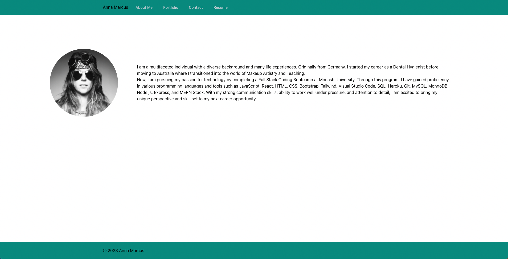
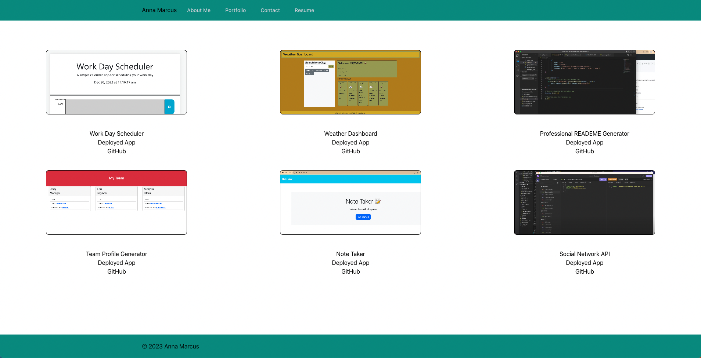
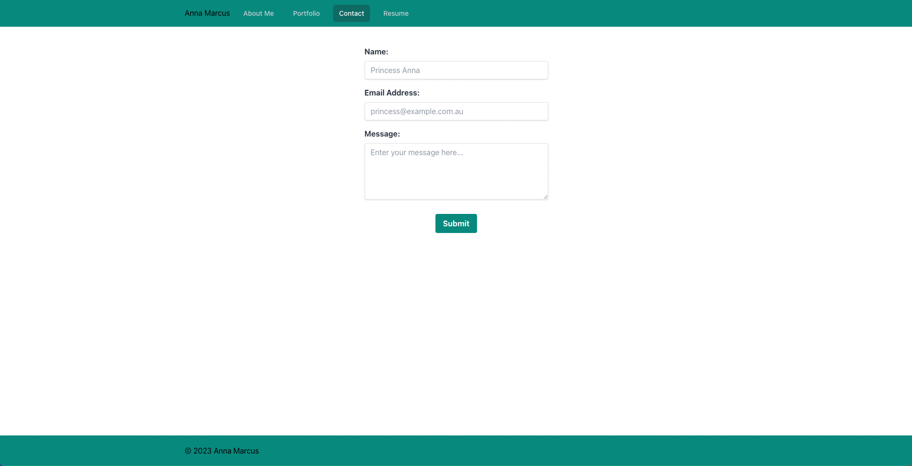
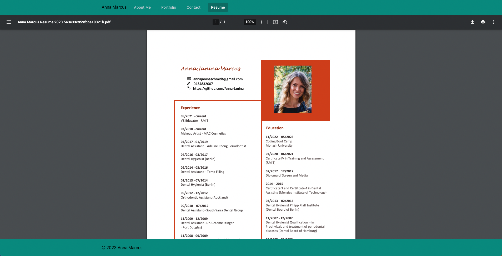

# React Portfolio

**Table of Contents**
-
- [Project Description](#project-description)
- [Technologies used](#technologies-used)
- [Usage](#usage)
- [Questions](#questions)
- [License](#license)

**Project Description**
-
This is a single-page deployed portfolio that showcases the author's React and Tailwind skills.

**Technologies used:**
-
- React
- Tailwind

## Usage
-
- 
- 
- 
- 

## Questions
-
- Anna Marcus
- GitHub Username: Anna-Janina

**License**
-
- 
